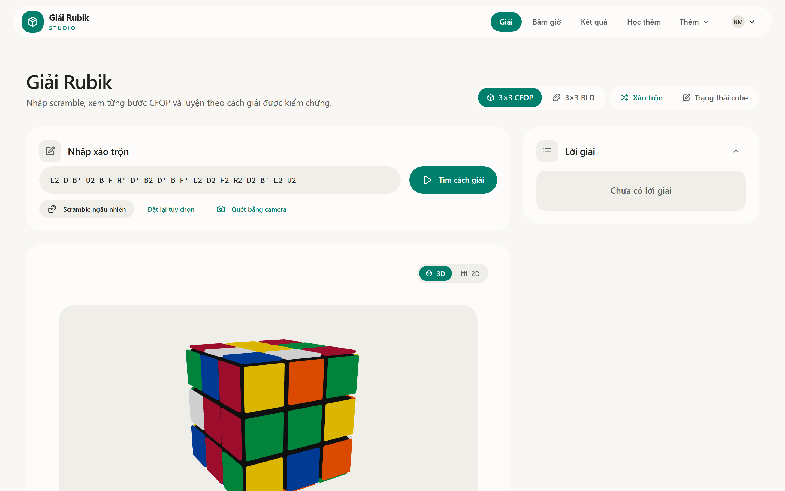
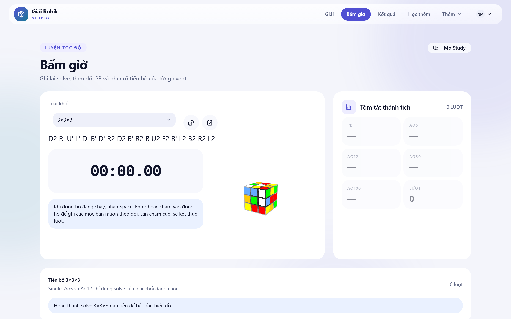
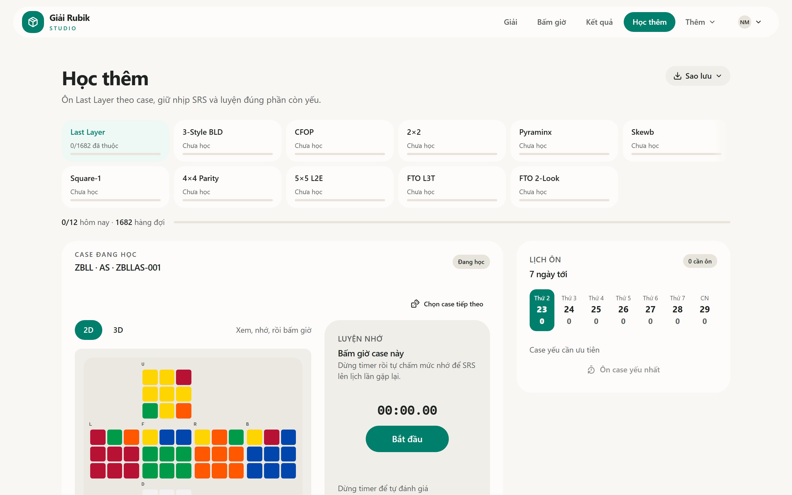

# CFOP Solver Studio

Open-source web app to solve, practise, time and compete at CFOP (3×3 Rubik's Cube) online.

[](https://github.com/Minhtuan622/cfop_solver_web/actions/workflows/ci.yml)
[](LICENSE)

## Demo

Try the live app: [cfop-solver.studio](https://cfop-solver.studio) (if available).

## Screenshots

| Solver | CFOP solution | Timer |
|--------|---------------|-------|
|  |  |  |

| Results | Study | Settings |
|---------|-------|----------|
|  |  |  |

Regenerate them with `node scripts/capture-screenshots.mjs` while the dev server is running. The Results page is captured with demo data (eight 3×3 solves seeded into `localStorage`) so it shows metrics, the trend chart and the history list; other pages show the app's default states.

## Features

- CFOP/BLD solver: enter a scramble or the six-face state, per-phase report, CubeNet/3D, the "Auto" opening (tries XXXXCross → XXXCross → XXCross → XCross; search depth is configurable in Settings — 8 moves by default) and Last Layer case recognition (OLL/PLL, ZBLL, 1LLL) on the banner and in the phase list.
- Multi-event timer with inspection, +2/DNF, splits, replay, history, statistics and an adjustable scramble font size.
- Study: Last Layer and 3-Style BLD.
- Account, cloud sync, WCA, competition rooms and leaderboard.
- The solver runs entirely in the browser: written in Rust and compiled to
  WebAssembly (~300 KB, downloaded on the first solve). The solver and the BLD
  algorithm catalog are kept on the visitor's machine, so they keep working
  offline after the first load.

## Run without a Database

The app can run most client-side features without a Database:

- Solve cube (solver), timer (Timer), study (Study), view local solve history.
- Theme, language and settings customization.

Features that **require** DATABASE_URL:
- CFOP account (sign up/sign in, change password).
- Cloud sync between devices.
- Competition rooms and leaderboard.
- WCA OAuth linking.

## Quick start locally

Requires Node.js 22+, pnpm **10.34.5**, Docker Desktop, Git and **Rust** (stable, via [rustup](https://rustup.rs)) with the WebAssembly target and `wasm-pack`. Local database uses MariaDB via Docker Compose — no need to install MySQL/MariaDB directly on macOS or Windows.

```bash
rustup target add wasm32-unknown-unknown
cargo install wasm-pack --locked
```

`wasm-opt` (the Binaryen package, e.g. `brew install binaryen` or `apt install binaryen`) is optional: with it the `.wasm` file is about 35% smaller.

```bash
git clone https://github.com/Minhtuan622/cfop_solver_web.git
cd cfop_solver_web
corepack enable
pnpm install --frozen-lockfile
pnpm build:solver
pnpm db:setup
pnpm dev
```

`pnpm build:solver` compiles the Rust solver in [`packages/solver`](packages/solver) to `packages/solver/solver-wasm/pkg` (glue JS, `.wasm`, TypeScript types). That folder is **not committed**; re-run the command after changing Rust code. `pnpm check`, `pnpm test`, `pnpm dev` and `pnpm build` all need it (`pnpm dev` and `pnpm build` build it themselves when it is missing and `wasm-pack` is installed).

`pnpm db:setup` starts MariaDB at `127.0.0.1:3307`, creates/updates `.env.local` and applies Drizzle migrations. Start Docker Desktop first. Then open `http://localhost:3000`.

Common local database commands:

```bash
pnpm db:stop   # stop container, keep data
pnpm db:logs   # view MariaDB logs
pnpm db:reset  # delete volume and recreate database
```

Account, cloud sync, Rooms and WCA flows require `DATABASE_URL`. WCA OAuth and password-reset email are optional; see [.env.example](.env.example) and [development guide](docs/development/project-guide.md).

## Pre-Pull-Request checklist

```bash
pnpm build:solver
pnpm check
pnpm test --run
pnpm exec playwright install  # first time, if Chromium is not installed
pnpm test:e2e
pnpm build
pnpm audit --prod --audit-level=high
```

`pnpm test:e2e` uses Playwright-managed Chromium (downloaded automatically). No system Chromium path required.

The Rust solver has its own tests, run in `packages/solver`:

```bash
cd packages/solver
cargo fmt --all -- --check
cargo clippy --workspace --all-targets -- -D warnings
cargo test --workspace
cargo run --release -p cfop --example bench   # Cross/F2L benchmark (p50, p95)
```

`pnpm build` **runs `tsc --noEmit` first**, so a build failure locally is a type error and not just a bundling error. Running `pnpm check` separately is still useful because it is faster (no bundling).

## Automated quality gates

Beyond unit tests and e2e, the repo has a few dedicated gates — all of them run in CI and all of them go **red** on a violation:

| Gate | Command | What it blocks |
|---|---|---|
| Token contrast | `pnpm test --run server/contrast.test.ts` | A main colour pair falling below WCAG AA (4.5:1 for text, 3:1 for the focus ring and status icons) in **both** light and dark mode. |
| Contrast on real pages | `pnpm exec playwright test e2e/contrast-a11y.spec.ts` | New axe violations on the 6 main pages × 2 modes, and a stale known-violations list (`e2e/contrast-a11y.baseline.json`). |
| Solver properties | `cd packages/solver && cargo test --workspace` | A Cross longer than 8 moves, F2L breaking the cross or a solved pair, any of the 216 orientation / 288 permutation last-layer states not solved, an OLL/PLL/ZBLL/1LLL algorithm not producing its own case, or any of 5000 random scrambles not ending solved. |
| Solver performance | `node scripts/bench-solver.mjs --check` | The solver (the real WebAssembly build) returning a wrong answer, or either scenario exceeding its budget: `cross` (20s/scramble, 80s total) or `auto` (60s/scramble, 200s total). |
| Release contains the solver | `node scripts/verify-solver-dist.mjs` (last step of `pnpm build`) | `dist` missing the solver worker or a valid `.wasm` file. |
| Preview matches the solver | `pnpm test --run client/src/lib/fastCube.solver.test.ts` | The in-page scramble preview tables disagreeing with the solver for any move (faces, slices, rotations, wide). |

The full contrast report (measurement table, pairs still below target, and the limits of the measurement) lives in [docs/validation/contrast-report.md](docs/validation/contrast-report.md).

## CI

The `CI` workflow runs **3 jobs** in parallel on every push and pull request:

| Job | What it does |
|---|---|
| `Rust solver (fmt, clippy, test)` | `cargo fmt --check`, `cargo clippy -D warnings`, `cargo test` for `packages/solver` |
| `check-test-build` | build the WASM solver → typecheck → unit tests → e2e → production build → dependency audit |
| `Solver benchmark (WASM)` | measures solver performance in check mode and uploads a JSON artifact to track the trend |

All three are **required status checks** for merging into `main` — see [docs/REPO-OWNER-CHECKLIST.md](docs/REPO-OWNER-CHECKLIST.md).

## Documentation

- [Documentation index](docs/README.md)
- [Detailed development guide](docs/development/project-guide.md)
- [Colour contrast report](docs/validation/contrast-report.md)
- [Open work items](TODO.md)
- [Contributing](CONTRIBUTING.md)
- [Code of Conduct](CODE_OF_CONDUCT.md)
- [Security vulnerability reporting](SECURITY.md)

## Tech stack

- Frontend: React 19 + TypeScript 7 + Vite 8, Tailwind CSS/Studio UI.
- Backend: Express 5 + tRPC 11, Drizzle ORM, MySQL/MariaDB.
- Cubing.js and Three.js for scrambles and the 3D cube.
- The CFOP solver is written in Rust, compiled to WebAssembly and run in a Web Worker.
- Vitest/Testing Library for unit tests; Playwright for browser E2E.

The solver lives in [`packages/solver`](packages/solver), a Cargo workspace with three crates:

| Crate | Contents |
|---|---|
| `cube-core` | Cubie model (8 corners, 12 edges, 6 centers), every move U R F D L B / M E S / x y z / wide, parsing and formatting, validated conversion to and from the 54-sticker URFDLB string. Standard library only. |
| `cfop` | Cross and F2L (IDA* with pruning tables), 57 OLL cases, 21 PLL cases with AUF, XCross..XXXXCross, ZBLL and 1LLL. |
| `solver-wasm` | wasm-bindgen bindings for the browser; TypeScript types generated with tsify. |

After changing Rust code, run `pnpm build:solver` to rebuild the WebAssembly package (`packages/solver/solver-wasm/pkg`, not committed). Verification results and solver benchmarks: [docs/validation/rust-wasm-solver.md](docs/validation/rust-wasm-solver.md).

## Contributing

Issues, documentation, testing and Pull Requests are welcome. Please read [CONTRIBUTING.md](CONTRIBUTING.md) before getting started.

## License

[MIT](LICENSE)
